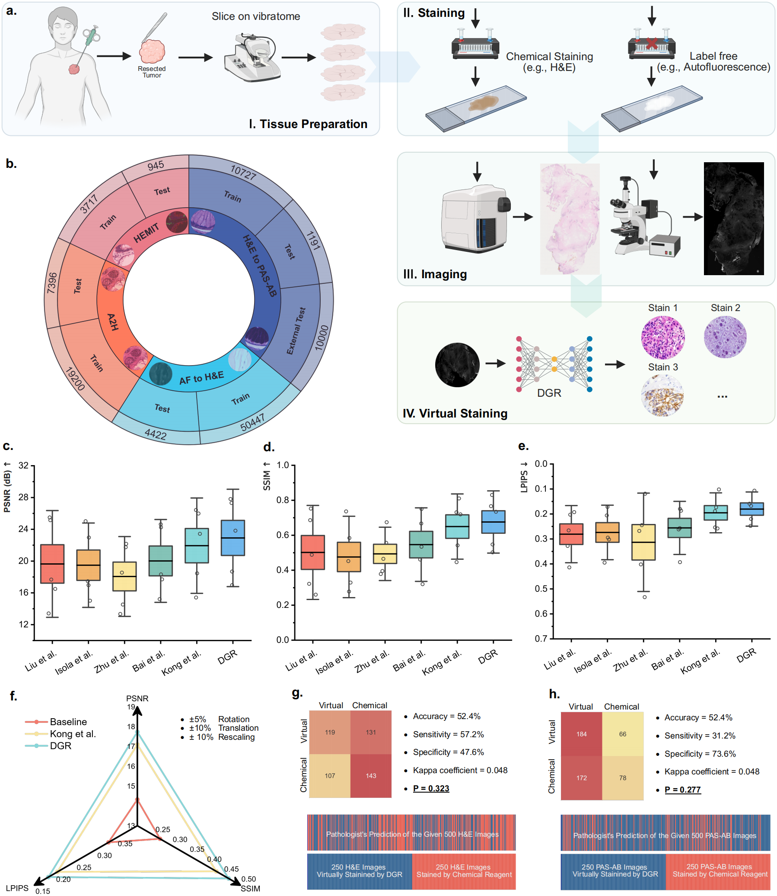

<!-- # DTR
##  -->
  
[](https://arxiv.org/abs/2509.14119)

[](https://x.com/SMARTLab_HKUST)


--- 
**Last Updated**: 27/04/2025

The official implementation of DGR, a generative AI model for virtual staining in histopathology workflows.



## Overview
DGR is a novel  framework designed for virtual staining of histopathology images with enhanced resistance to misalignment. Our method enables:
- High-fidelity stain transformation between different histopathology modalities
- Robust performance despite common tissue section misalignments
- Significant acceleration of histopathology workflows

## Key Features
- 🚀 **High-quality transformations**
- 🔄 **Misalignment-resistant**
- ⏱️ **Fast inference**
- 📊 **Multi-dataset support**
- 🧠 **Modular architecture**

## Installation

### Setup
1. Clone this repository:
```bash
git clone https://github.com/birkhoffkiki/DTR.git
cd DTR
conda create --name DTR python=3.9
conda activate DTR
pip install -r requirements.txt
```

### Data preparation

* Aperio-Hamamatsu dataset: https://github.com/khtao/StainNet
* HEMIT dataset: https://github.com/BianChang/HEMIT-DATASET  

### Training
```bash
# For Aperio-Hamamatsu dataset
bash train_aperio.sh

# For HEMIT dataset
bash train_hemit.sh
```
## Pretrained Models

| Model Name       | Download Link |
|------------------|---------------|
| AF2HE Weight     | [Download](https://github.com/birkhoffkiki/DTR/releases/download/weights/af2he_weight.pth) |
| HE2PAS Weight   | [Download](https://github.com/birkhoffkiki/DTR/releases/download/weights/he2pas_weight.pth) |
| HEMIT Weight    | [Download](https://github.com/birkhoffkiki/DTR/releases/download/weights/hemit_weight.pth) |
| Aperio Weight   | [Download](https://github.com/birkhoffkiki/DTR/releases/download/weights/aperio_weight.pth) |


## Inference
Example notebook: [play_with_the_pretrained_model.ipynb](https://github.com/birkhoffkiki/DTR/blob/main/visualize.ipynb)

## contact

if you have any questions, please feel free to contact me:  

* JIABO MA, jmabq@connect.ust.hk

## Citation
@misc{DGR,  
      title={Generative AI for Misalignment-Resistant Virtual Staining to Accelerate Histopathology Workflows},   
      author={Jiabo MA and Wenqiang Li and Jinbang Li and Ziyi Liu and Linshan Wu and Fengtao Zhou and Li Liang and Ronald Cheong Kin Chan and Terence T. W. Wong and Hao Chen},  
      year={2025},  
      eprint={2509.14119},  
      archivePrefix={arXiv},  
      primaryClass={cs.CV},  
      url={https://arxiv.org/abs/2509.14119},   
}
